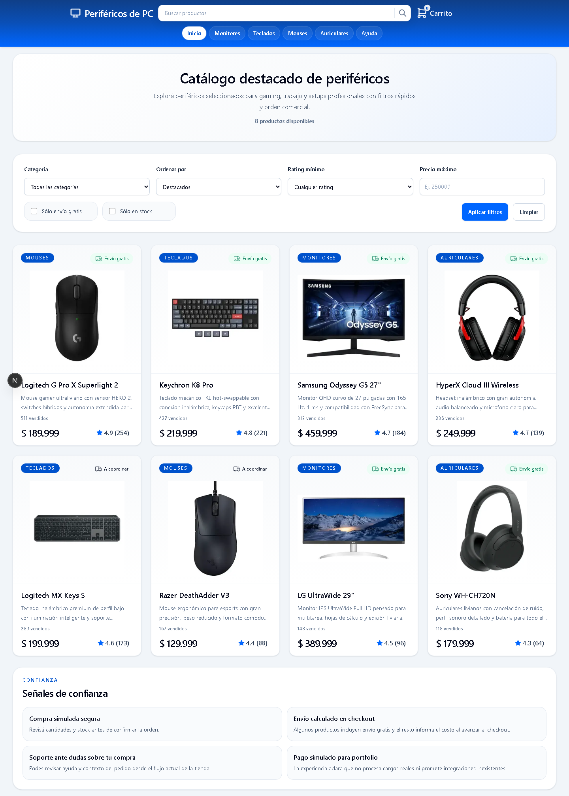
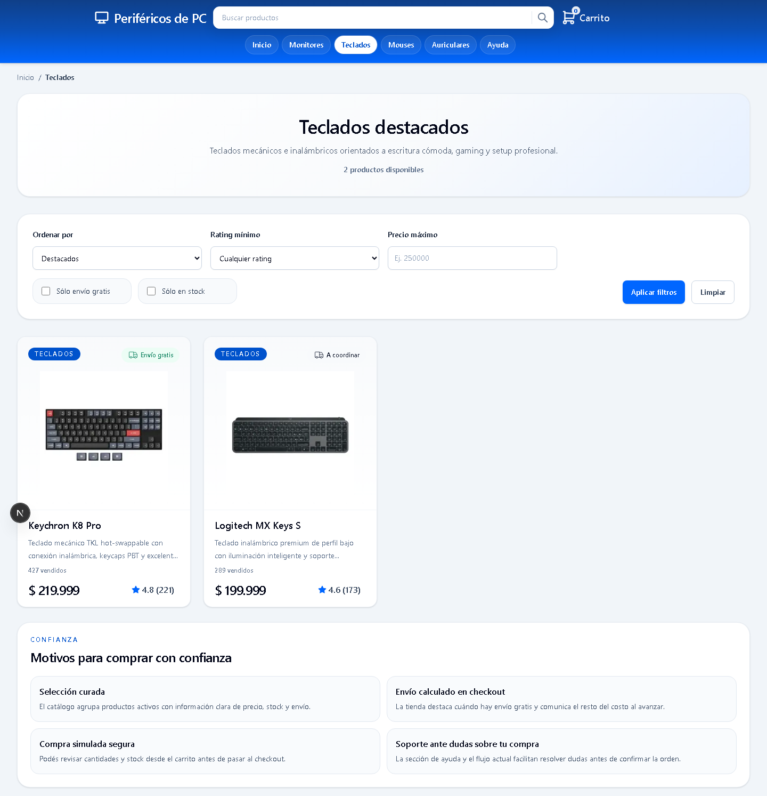
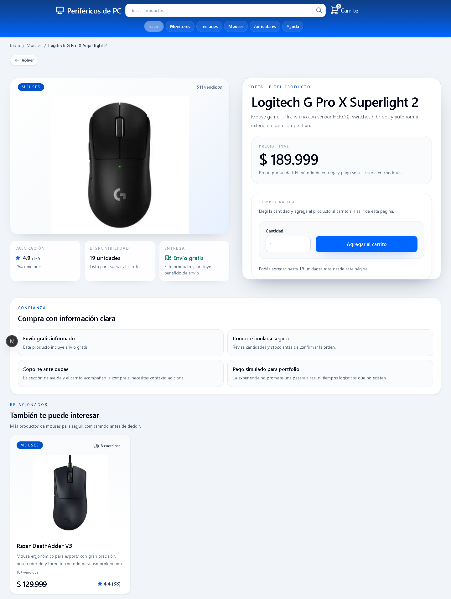
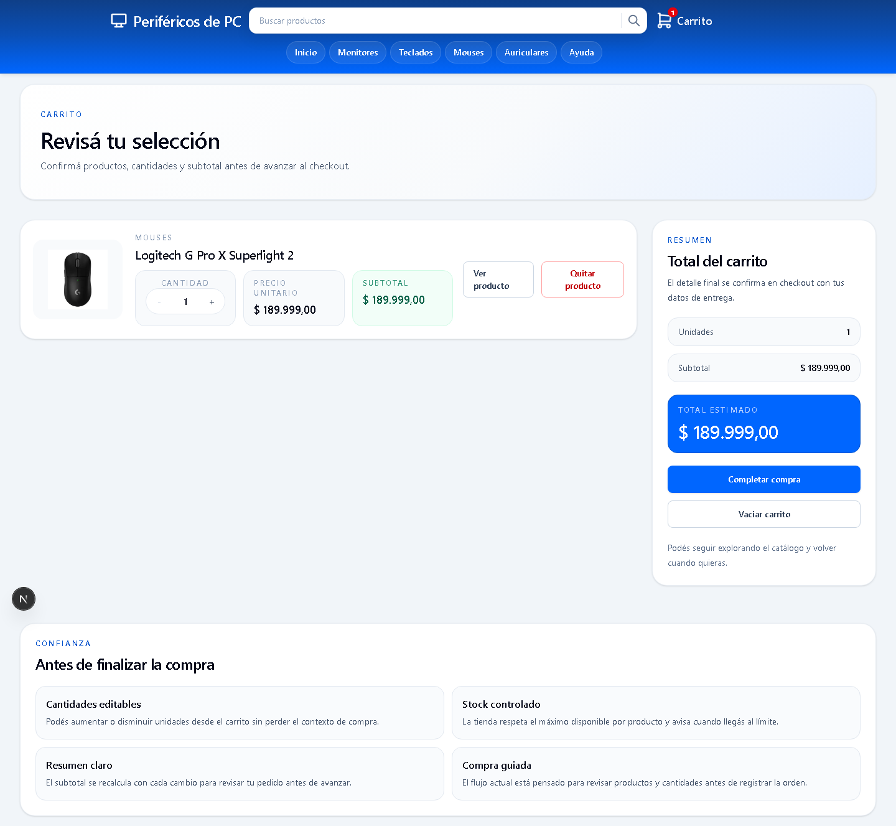
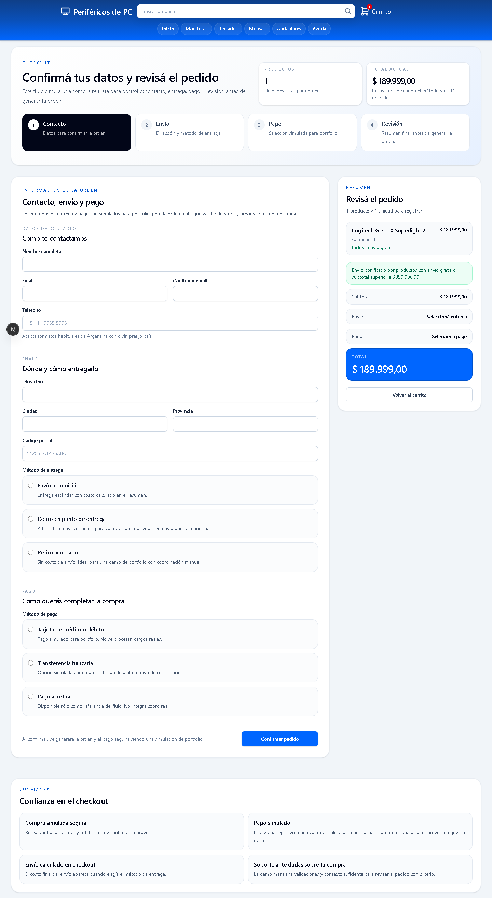

# Perifericos de PC

Portfolio e-commerce storefront built with Next.js App Router, TypeScript, Tailwind CSS, Prisma, Neon PostgreSQL, and Zod. It demonstrates a realistic catalog, cart, and simulated checkout flow without claiming production commerce features such as real payments, shipping, authentication, or an admin dashboard.

[](https://github.com/emanuel-tivano/tech-store/actions/workflows/ci.yml)


## Demo

- Live app: https://tech-store-gilt.vercel.app

## Feature summary

- Product catalog with search, filters, sorting, category navigation, and empty states.
- Product detail pages with clean slugs, related products, stock visibility, and purchase CTA.
- Editable cart with quantity controls, stock limits, and local persistence.
- Simulated checkout with contact, shipping, payment selection, summary, and order creation.
- Responsive storefront flow across mobile, tablet, and desktop layouts.
- Cart and checkout are intentionally non-indexable, while catalog and product pages include SEO metadata and structured data.

## Screenshots

Screenshots are stored in `docs/screenshots/`:

| Home | Category/catalog |
| --- | --- |
|  |  |

| Product detail | Cart | Checkout |
| --- | --- | --- |
|  |  |  |

To refresh them locally, run the app with a valid database-backed `.env.local`, add a product to the cart before visiting checkout, and capture the same routes.

## What this demonstrates

- **App Router architecture:** route-based pages, layouts, metadata, server components, server actions, and server-side data reads.
- **Realistic e-commerce UX:** browsable catalog, category filtering, PDPs, stock-aware cart behavior, empty states, and a checkout form designed as a believable purchase flow.
- **Server-side validation:** checkout input is validated in the UI and then validated again on the server with Zod before any order is persisted.
- **Prisma/PostgreSQL persistence:** product, category, order, and order item data are modeled with Prisma and stored in PostgreSQL.
- **Stock-safe checkout transaction:** order creation reloads authoritative product data from the database and decrements stock inside a Prisma transaction.
- **Technical SEO:** canonical URLs, sitemap, robots rules, route metadata, Open Graph data, slug-based product URLs, and JSON-LD for key page types.
- **Testing strategy:** Vitest and Testing Library cover domain/UI behavior, while Playwright provides a smoke check for the main storefront path.

## Data integrity highlight

The checkout does not trust client-submitted prices, stock, or product availability. When an order is created, the server reloads the selected products from PostgreSQL, rejects missing/inactive/duplicate items, recalculates prices from database data, and decrements inventory inside a Prisma transaction.

That keeps the portfolio scope honest while still showing the core integrity pattern expected from a real commerce backend: the database is the source of truth, and stock changes are committed atomically with the order.

## Architecture decisions

### App Router and rendering

Next.js App Router keeps routing, metadata, loading boundaries, and server-side catalog reads close to each route. Catalog and product pages remain Server Components; client components are limited to interactive state such as search controls, cart persistence, and checkout form behavior.

The main catalog, category, product, and sitemap routes use timed revalidation. Catalog reads are wrapped through shared cache utilities so future cache and invalidation changes stay centralized.

### Server-side checkout

Checkout submits through a Server Action. The client provides customer data and product identifiers/quantities, but it does not decide final prices, availability, or stock. Known domain failures return stable error codes and safe Spanish messages; unexpected database failures stay behind a generic retry message.

### Prisma + PostgreSQL

Prisma is the data access layer for categories, products, inventory, and orders. Neon PostgreSQL stores the catalog and order model, while Prisma migrations keep schema changes explicit and reviewable.

### Price and stock integrity

Before creating an order, the server reloads products from PostgreSQL, rejects missing, inactive, duplicated, or insufficient-stock items, and recalculates totals from database prices. Order creation and stock decrements run in one Prisma transaction, with a conditional stock update to protect against concurrent purchases.

### Zod validation

Reusable Zod schemas define customer, address, delivery, payment, and order-item rules. The checkout UI uses those same field schemas for immediate feedback, while the server validates the complete payload again before opening the transaction.

### Client-side persistence

Cart state persists in `localStorage`, and incomplete checkout form values persist in `sessionStorage`. Both are convenience layers only; the server remains the source of truth for purchasable products and inventory.

### Technical SEO

Implemented SEO work includes:

- `sitemap.xml`
- `robots.txt`
- Canonical URLs
- Per-page metadata
- Open Graph fields
- JSON-LD
- Product slug routes under `/products/[slug]`

Structured data is included for `WebSite`, `Store`, `BreadcrumbList`, and `Product`.

## Testing

Current coverage focuses on:

- Cart reducer and cart hydration.
- Catalog search helpers.
- Checkout validation.
- Order creation flow.
- Not-found route behavior.
- Main ecommerce smoke flow: home/catalog -> PDP -> cart -> checkout.

Pre-ship verification:

```bash
npm run lint
npm test
npm run build
```

GitHub Actions runs the same install, lint, test, migration, and build sequence on pushes and pull requests to `main`. CI uses an ephemeral PostgreSQL service with non-production credentials, so no database secret is required for the workflow.

E2E smoke:

```bash
npx playwright install chromium
npm run test:e2e
```

## Local setup

```bash
npm install
cp .env.local.example .env.local
npx prisma migrate dev
npm run db:seed
npm run dev
```

On Windows PowerShell, if `cp` is unavailable:

```powershell
Copy-Item .env.local.example .env.local
```

Required environment variables:

- `DATABASE_URL`
- `DIRECT_URL`
- `NEXT_PUBLIC_SITE_URL`

For Vercel, configure all three variables for Preview and Production. `DATABASE_URL` is used by the running application, `DIRECT_URL` is used by Prisma migrations, and `NEXT_PUBLIC_SITE_URL` should be the canonical production origin, for example `https://tech-store-gilt.vercel.app`.

Apply production migrations before relying on a new schema:

```bash
npx prisma migrate deploy
```

The catalog is database-backed and the main routes use timed revalidation, so builds and deployed requests need a reachable PostgreSQL database with the existing migrations applied. Product images are local files under `public/products`; no external image host configuration is required.

## Trade-offs

Deliberately out of scope for this portfolio version:

- **No real payments:** payment options model the checkout decision without handling cards or claiming production payment security.
- **No authentication:** the project focuses on the public storefront and order integrity rather than account lifecycle and authorization.
- **No admin panel:** catalog and stock management stay database/seed driven to keep the portfolio scope centered on the customer flow.
- **No real shipping integration:** delivery methods and costs are representative; there are no carrier quotes, labels, or tracking.
- **Simulated checkout:** orders are persisted and stock rules are real, but there is no charge, fulfillment workflow, or transactional email.

## What I would improve next

- Add a dedicated order confirmation page with a safe lookup token.
- Improve checkout feedback with field focus and retry guidance for stock changes.
- Expand Playwright coverage for empty states, validation errors, and successful checkout.
- Add an authenticated admin dashboard for catalog and order operations.
- Integrate a payment provider in sandbox mode.
